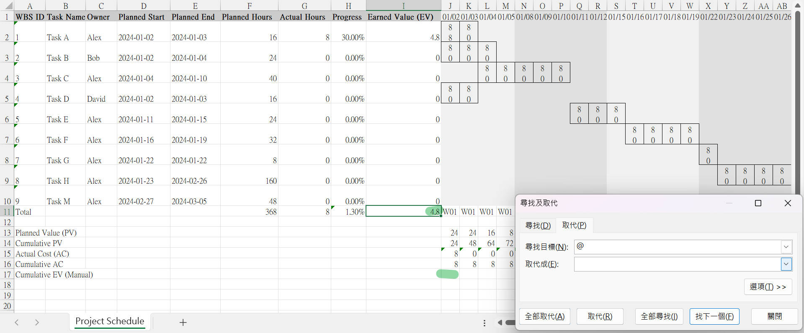

# pm-big-table-2024-09
這個程式是為專案經理（PM）設計的python工具，基於使用者提供的工作分解結構（WBS）和任務依賴關係進行專案規劃和追蹤。

PM 首先需要定義專案的 WBS，包括每個任務的詳細信息（如任務名稱、持續時間、負責人）以及任務之間的先後順序關係。基於這些輸入，程式會自動計算專案進度、生成甘特圖、分析關鍵路徑，並製作詳細的 Excel 報告。



# 項目管理大表工具使用指南

## 功能介紹

此工具提供以下功能：
1. 項目排程計算
2. 甘特圖生成
3. 關鍵路徑分析
4. 詳細排程顯示
5. Excel 報告生成

## 環境設定

1. 確保您的系統已安裝 Python 3.6 或更高版本。
2. 安裝必要的依賴庫：
   ```
   pip install openpyxl
   ```

## 操作步驟

1. 導入必要的庫：
   ```python
   from datetime import datetime
   from pm_big_table import PMBigTable
   ```

2. 設定假期（如果有的話）：
   ```python
   holidays = [datetime(2024, 2, 8).date(), datetime(2024, 2, 9).date(), datetime(2024, 2, 12).date(), 
               datetime(2024, 2, 13).date(), datetime(2024, 2, 14).date()]
   ```

3. 創建 PMBigTable 實例：
   ```python
   pm_tool = PMBigTable(working_days_per_week=5, project_start_date=datetime(2024, 1, 2), 
                        duration_unit='day', display_unit='day', holidays=holidays)
   ```

4. 準備工作分解結構（WBS）數據：
   ```python
   wbs_data = [
       {'WBS': '1', 'Task': 'Task A', 'Duration': 2, 'Predecessors': '', 'Owner': 'Alex'},
       {'WBS': '2', 'Task': 'Task B', 'Duration': 3, 'Predecessors': '', 'Owner': 'Alex'},
       {'WBS': '3', 'Task': 'Task C', 'Duration': 5, 'Predecessors': '', 'Owner': 'Alex'},
       {'WBS': '4', 'Task': 'Task D', 'Duration': 2, 'Predecessors': '', 'Owner': 'Alex'},
       {'WBS': '5', 'Task': 'Task E', 'Duration': 3, 'Predecessors': 'Task D', 'Owner': 'Alex'},
       {'WBS': '6', 'Task': 'Task F', 'Duration': 4, 'Predecessors': 'Task D', 'Owner': 'Alex'},
       {'WBS': '7', 'Task': 'Task G', 'Duration': 1, 'Predecessors': 'Task B, Task F', 'Owner': 'Alex'},
       {'WBS': '8', 'Task': 'Task H', 'Duration': 20, 'Predecessors': 'Task G, Task E', 'Owner': 'Alex'},
       {'WBS': '9', 'Task': 'Task M', 'Duration': 6, 'Predecessors': 'Task H', 'Owner': 'Alex'},
   ]
   ```

5. 載入 WBS 數據：
   ```python
   pm_tool.load_wbs(wbs_data)
   ```

6. 使用各種功能：
   ```python
   pm_tool.print_schedule()
   pm_tool.print_gantt_chart()
   pm_tool.print_critical_path()
   pm_tool.print_detailed_schedule()
   pm_tool.generate_excel("project_schedule.xlsx")
   ```

## 輸出結果範例

執行上述步驟後，您將看到類似以下的輸出：

```
Project Schedule:
Task A: Start - 2024-01-02, End - 2024-01-03, Duration - 2 days, Owner - Alex
Task B: Start - 2024-01-04, End - 2024-01-08, Duration - 3 days, Owner - Alex
Task C: Start - 2024-01-09, End - 2024-01-15, Duration - 5 days, Owner - Alex
Task D: Start - 2024-01-16, End - 2024-01-17, Duration - 2 days, Owner - Alex
Task E: Start - 2024-01-18, End - 2024-01-22, Duration - 3 days, Owner - Alex
Task F: Start - 2024-01-23, End - 2024-01-26, Duration - 4 days, Owner - Alex
Task G: Start - 2024-01-29, End - 2024-01-29, Duration - 1 days, Owner - Alex
Task H: Start - 2024-01-30, End - 2024-03-04, Duration - 20 days, Owner - Alex
Task M: Start - 2024-03-05, End - 2024-03-12, Duration - 6 days, Owner - Alex

Gantt Chart:
          23456789111111111122222222223312345678911111111112222222222123456789111
Task A    ==                                                                      Alex
Task B      ==--=                                                                 Alex
Task C           ====--=                                                          Alex
Task D                  ==                                                        Alex
Task E                    ==--=                                                   Alex
Task F                         ====                                               Alex
Task G                               =                                            Alex
Task H                                ====--===-------==--=====--=====--=         Alex
Task M                                                                   ====--== Alex

Critical Path (Resource Constrained):
  Task A: 2 days - Start: 2024-01-02, End: 2024-01-03, Owner: Alex
  Task B: 3 days - Start: 2024-01-03, End: 2024-01-08, Owner: Alex
  Task C: 5 days - Start: 2024-01-08, End: 2024-01-15, Owner: Alex
  Task D: 2 days - Start: 2024-01-15, End: 2024-01-17, Owner: Alex
  Task E: 3 days - Start: 2024-01-17, End: 2024-01-22, Owner: Alex
  Task F: 4 days - Start: 2024-01-22, End: 2024-01-26, Owner: Alex
  Task G: 1 days - Start: 2024-01-26, End: 2024-01-29, Owner: Alex
  Task H: 20 days - Start: 2024-01-29, End: 2024-03-04, Owner: Alex
  Task M: 6 days - Start: 2024-03-04, End: 2024-03-12, Owner: Alex
Total duration of critical path: 46 days
```

此外，將生成一個名為 "project_schedule.xlsx" 的 Excel 文件，其中包含詳細的項目排程。

**注意：使用 Excel 報告時，請記得移除所有 '@' 符號以確保公式正常運作。**

## 使用限制

1. 每個任務只能有一個負責人。
2. 所有時間單位均為天。
3. 工作時間假設為每天 8 小時。
4. 該工具考慮了資源限制（同一時間只能執行一個任務）。

## 不支援的功能

1. 不支持多資源分配。
2. 不支持多項目管理。
3. 不支持實時協作編輯。


